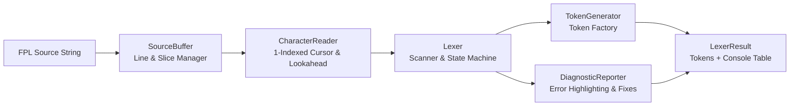

# FinPolicy Compiler — Lexical Analyzer API & Architecture

## 1. Architecture Overview

The FPL Lexical Analyzer (`@finpolicy/compiler`) is engineered as a modular, streaming scanner that transforms raw FPL source code into a strongly-typed token stream with 1-indexed source coordinates and rich diagnostics.



### Module Responsibilities

| Module | File | Responsibility |
|---|---|---|
| **Token Types** | [`token-types.ts`](file:///c:/Users/User/Desktop/compiler-project/compiler/src/lexer/token-types.ts) | `TokenType` enum, `TokenCategory` enum, reserved keyword lookup tables, operator & delimiter maps |
| **Source Buffer** | [`source-buffer.ts`](file:///c:/Users/User/Desktop/compiler-project/compiler/src/lexer/source-buffer.ts) | Stores raw source code, file metadata, line boundaries, and fast substring slices |
| **Character Reader** | [`character-reader.ts`](file:///c:/Users/User/Desktop/compiler-project/compiler/src/lexer/character-reader.ts) | Maintains `offset`, `line`, and `column` cursor with `peek(k)`, `advance()`, and `match()` |
| **Token Generator** | [`token-generator.ts`](file:///c:/Users/User/Desktop/compiler-project/compiler/src/lexer/token-generator.ts) | Constructs immutable `Token` objects with start/end positions and literal values |
| **Diagnostic Reporter** | [`diagnostic-reporter.ts`](file:///c:/Users/User/Desktop/compiler-project/compiler/src/lexer/diagnostic-reporter.ts) | Records lexical errors (`FPL-L001` – `FPL-L008`), builds caret underlines, and formats fix suggestions |
| **Utilities** | [`lexer-utils.ts`](file:///c:/Users/User/Desktop/compiler-project/compiler/src/lexer/lexer-utils.ts) | Character classifiers, ISO date validator, identifier length/naming validator, and ASCII table formatter |
| **Lexer** | [`lexer.ts`](file:///c:/Users/User/Desktop/compiler-project/compiler/src/lexer/lexer.ts) | Main lexical scanner implementing `tokenize()`, `nextToken()`, `peek()`, `reset()`, and `getDiagnostics()` |

---

## 2. Public Compiler API

### `compileSource(source: string, fileName?: string): LexerResult`
Scans a complete FPL source string in a single pass and returns the token stream, diagnostics, and formatted console table.

```typescript
import { compileSource } from '@finpolicy/compiler';

const result = compileSource(
  `POLICY LoanApproval
WHEN
    AGE >= 21`,
  'loan_approval.fpl',
);

console.log(result.formattedTable);
```

### `class Lexer`
Provides both batch scanning (`tokenize()`) and streaming iteration (`nextToken()`, `peek()`).

| Method | Signature | Description |
|---|---|---|
| `tokenize` | `(source?: string, fileName?: string): LexerResult` | Tokenizes the entire source buffer and caches the token stream |
| `nextToken` | `(): Token` | Returns and consumes the next token from the stream |
| `peek` | `(lookahead?: number): Token` | Inspects the token at `cursor + lookahead` without consuming it |
| `reset` | `(): void` | Resets character reader, token cursor, and diagnostics |
| `getDiagnostics` | `(): LexerDiagnostic[]` | Returns all lexical diagnostics accumulated during scanning |
| `isAtEnd` | `(): boolean` | Returns `true` when the `EOF` token has been reached |

---

## 3. Lexical Diagnostic Codes

| Code | Condition | Suggested Fix |
|---|---|---|
| `FPL-L001` | Unknown or unexpected character | Remove the character or replace with a valid FPL operator |
| `FPL-L002` | Unterminated string literal | Add a closing quote before the end of the line |
| `FPL-L003` | Malformed number or invalid identifier (e.g., `123.45.67`, `2ndLoan`) | Format decimal with a single point or start identifiers with a letter |
| `FPL-L004` | Invalid calendar date literal | Use valid ISO-8601 date (`DATE("YYYY-MM-DD")` or `@YYYY-MM-DD`) |
| `FPL-L005` | Invalid string escape sequence | Use `\"`, `\\`, `\n`, `\t`, or `\r` |
| `FPL-L006` | Unterminated multi-line comment | Close the block comment with `*/` |
| `FPL-L007` | Invalid currency literal format | Follow currency symbol/constructor with a valid number (`$1000.00`, `CURRENCY(1000.00)`) |
| `FPL-L008` | Invalid percentage literal format | Follow numeric rate with a single `%` (`12.5%`) |
