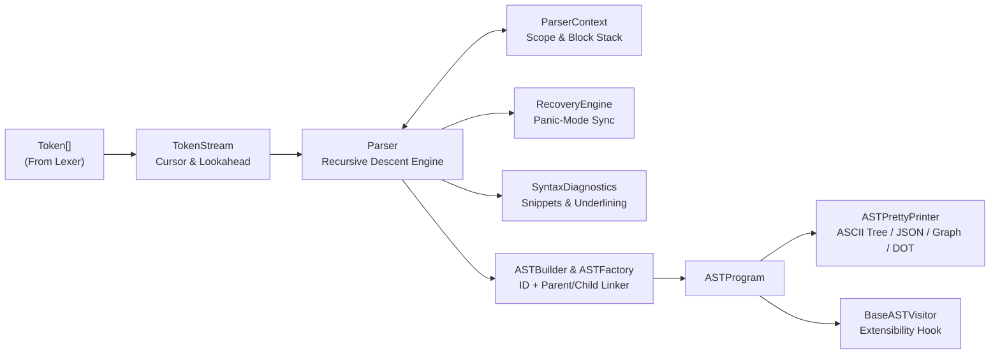

# FinPolicy Compiler — Parsing Engine & AST Specification

## 1. Parser Architecture

The FPL Parsing Engine (`@finpolicy/compiler`) is a modular **Recursive Descent Parser** that consumes ONLY the `Token[]` stream produced by the Lexer and constructs a strongly-typed Abstract Syntax Tree (`ASTProgram`).



### Module Inventory

| Module | File | Responsibility |
|---|---|---|
| **AST Definitions** | [`ast.interface.ts`](file:///c:/Users/User/Desktop/compiler-project/compiler/src/ast/ast.interface.ts) | Interfaces for all Root, Declaration, Statement, and Expression AST nodes |
| **AST Factory** | [`ast-factory.ts`](file:///c:/Users/User/Desktop/compiler-project/compiler/src/ast/ast-factory.ts) | Allocates unique node IDs (`ast_1`, `ast_2`), computes spans, and links `parent`/`children` |
| **AST Builder** | [`ast-builder.ts`](file:///c:/Users/User/Desktop/compiler-project/compiler/src/ast/ast-builder.ts) | Semantic builder methods for constructing every FPL AST node |
| **AST Visitor** | [`ast-visitor.ts`](file:///c:/Users/User/Desktop/compiler-project/compiler/src/ast/ast-visitor.ts) | `ASTVisitor<R>` interface and `BaseASTVisitor<R>` recursive dispatcher |
| **Pretty Printer** | [`ast-pretty-printer.ts`](file:///c:/Users/User/Desktop/compiler-project/compiler/src/ast/ast-pretty-printer.ts) | Formats ASCII box-drawing trees, cycle-free JSON, `{ nodes, edges }` graphs, and Graphviz DOT |
| **Token Stream** | [`token-stream.ts`](file:///c:/Users/User/Desktop/compiler-project/compiler/src/parser/token-stream.ts) | Token navigation (`peek`, `match`, `consume`, `check`) and token-based snippet reconstruction |
| **Parser Context** | [`parser-context.ts`](file:///c:/Users/User/Desktop/compiler-project/compiler/src/parser/parser-context.ts) | Tracks nested syntactic blocks (`POLICY`, `FUNCTION`, `RULE`, `IF`, `LOOP`, `TRY`) |
| **Syntax Diagnostics** | [`syntax-diagnostics.ts`](file:///c:/Users/User/Desktop/compiler-project/compiler/src/parser/syntax-diagnostics.ts) | Reports expected vs. found tokens, code snippets, caret underlining, and suggested fixes |
| **Recovery Engine** | [`recovery-engine.ts`](file:///c:/Users/User/Desktop/compiler-project/compiler/src/parser/recovery-engine.ts) | Panic-mode error recovery synchronizing at statement and declaration boundaries |
| **Recursive Descent Parser** | [`parser.ts`](file:///c:/Users/User/Desktop/compiler-project/compiler/src/parser/parser.ts) | Grammar rule parsers (`parseProgram`, `parsePolicy`, `parseFunction`, `parseStatement`, `parseExpression`) |

---

## 2. AST Node Metadata

Every node in the AST implements [`ASTNode`](file:///c:/Users/User/Desktop/compiler-project/compiler/src/ast/ast.interface.ts#L118-L138):

- `type`: Discriminated union (`Program`, `PolicyDeclaration`, `IfStatement`, `ComparisonExpression`, etc.)
- `id`: Unique identifier (`ast_1`, `ast_2`, ...)
- `parent`: Reference to parent `ASTNode | null`
- `children`: Ordered `ASTNode[]` array of child nodes
- `location`: `{ file, line, column, endLine, endColumn, startOffset, endOffset }`
- `line`, `column`, `startOffset`, `endOffset`: Top-level source span fields for UI highlighting

---

## 3. Sample AST Pretty Printer Output

```fpl
POLICY LoanApproval
    INPUT
        applicant : customer
    WHEN
        applicant.age >= 21
    THEN
        ALLOW WITH reason = "Approved"
    ELSE
        DENY WITH reason = "Denied"
END
```

`parseResult.prettyTree`:

```text
Program
 └── Policy LoanApproval
       ├── Input
       │     └── Parameter applicant: customer
       ├── Condition
       │     └── ComparisonExpression (>=)
       │           ├── Member .age
       │           │     └── Identifier applicant
       │           └── Literal [INTEGER] 21
       ├── Then
       │     └── Decision ALLOW
       │           └── Literal [STRING] "Approved"
       └── Else
             └── Decision DENY
                   └── Literal [STRING] "Denied"
```
