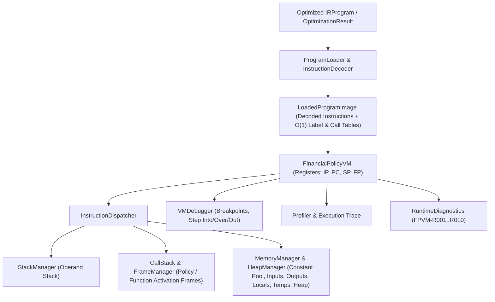

# FinPolicy Compiler (FPC) — Phase 4: Financial Policy Virtual Machine (FPVM) API & Architecture Reference

## 1. Overview & Strict Scope Boundaries

The **Financial Policy Virtual Machine (`FPVM`)** (`compiler/src/runtime/`) is a deterministic, stack-based Virtual Machine that executes the **Optimized Intermediate Representation (`IRProgram` / `OptimizationResult`)** generated by Phases 3D and 3E.

- **Inputs**:
  - `OptimizationResult`, `IRProgram`, or `CompiledArtifact`
  - Optional `ISymbolTable` for function/policy parameter metadata
  - Runtime Input Variables (`Record<string, unknown>`)
- **Outputs**:
  - `FPVMExecutionReport`:
    - `decision` (`APPROVE`, `REJECT`, `ALLOW`, `DENY`, `REVIEW`, `UNDECIDED`) & `normalizedDecision` (`ALLOW` | `DENY` | `REVIEW`)
    - `variables` (`inputs`, `outputs`, `globals`, `constants`, `locals`, `temporaries`)
    - `trace` (`VMExecutionTraceStep[]` recording instruction, line number, execution time, variable deltas, stack deltas, and VM registers)
    - `diagnostics` (`RuntimeDiagnostic[]` for `FPVM-R001` through `FPVM-R010`)
    - `logs` (`RuntimeLogEntry[]`)
    - `memoryStats` (`MemoryStatistics`)
    - `profiler` (`ProfilerReport`)
    - `formattedReport` (human-readable execution summary)
- **Strict Phase Boundary**: Executes Optimized IR in a managed Virtual Machine; does **not** generate Assembly, Machine Code, or Native Binaries.

---

## 2. Folder Structure (`compiler/src/runtime/`)

```text
compiler/src/runtime/
├── runtime.interface.ts        # Contracts for VM registers, frames, heap, trace, debugger, profiler & APIs
├── runtime-diagnostics.ts      # RuntimeDiagnostics (FPVM-R001..R010), RuntimeLogger & FPVMRuntimeException
├── stack-manager.ts            # StackManager (Operand Stack), FrameManager & CallStack (Policy/Function frames)
├── memory-manager.ts           # MemoryManager & HeapManager (5-tier memory model & byte accounting)
├── program-loader.ts           # InstructionDecoder & ProgramLoader (jump tables & subroutine entry resolution)
├── instruction-dispatcher.ts   # InstructionDispatcher (Command/Strategy execution of all IR opcodes & built-ins)
├── profiler.ts                 # Profiler (opcode frequencies, hot instructions, basic block counts, branch stats)
├── debugger.ts                 # VMDebugger (breakpoints, stepInto, stepOver, stepOut, pause, resume, restart)
├── virtual-machine.ts          # FinancialPolicyVM (VirtualMachine), ExecutionEngine & executePolicyIR()
└── index.ts                    # Public barrel exports
```

---

## 3. Virtual Machine Architecture & Memory Model



### 3.1 Hardware-Inspired Registers (`VMRegisterState`)
- **`IP` (`instructionPointer`)**: Index of the next decoded IR instruction to execute (`0 .. N-1`).
- **`PC` (`programCounter`)**: Total number of instructions executed in the current session.
- **`SP` (`stackPointer`)**: Top index of the VM Operand Stack (`-1` when empty).
- **`FP` (`framePointer`)**: Index of the active `StackFrame` in the Call Stack (`0` for root policy frame).

### 3.2 Runtime Error Codes (`RuntimeErrorCode`)
| Code | Error Category | Description |
|---|---|---|
| `FPVM-R001` | Division by Zero | Division (`/`) or Modulo (`%`) by `0` (including zero income/property value in `DTI`/`LTV`) |
| `FPVM-R002` | Stack Overflow | Operand Stack or Call Stack depth exceeded maximum limit |
| `FPVM-R003` | Stack Underflow | Attempted `POP` from an empty Operand Stack or Call Stack |
| `FPVM-R004` | Invalid Policy Call | Target policy in `POLICY_CALL` or rule in `RULE_APPLY` does not exist |
| `FPVM-R005` | Invalid Function Call | Target function in `CALL` is not defined in program or standard library |
| `FPVM-R006` | Null Reference Error | Field/index access or arithmetic/comparison on `null` or `undefined` |
| `FPVM-R007` | Memory Error | Array index out of bounds or heap memory limit exceeded |
| `FPVM-R008` | Invalid Jump Target | Branch targets an unresolved or out-of-range label |
| `FPVM-R009` | Assertion / Throw | `ASSERT` condition evaluated to `false` or explicit `THROW` executed |
| `FPVM-R010` | Execution Timeout | Exceeded `maxIterations` loop guard or `timeoutMs` wall-clock budget |

---

## 4. Programmatic Usage

```typescript
import { parseSource, analyzeSemantics, generateIR, optimizeIR, FinancialPolicyVM } from '@finpolicy/compiler';

const parsed = parseSource(fplSource);
const sem = analyzeSemantics(parsed.repository!, fplSource);
const ir = generateIR(sem, sem.symbolTable);
const optimized = optimizeIR(ir, { level: 2, symbolTable: sem.symbolTable });

const vm = new FinancialPolicyVM();
vm.loadProgram(optimized, sem.symbolTable);

// Full execution
const report = vm.execute({ salary: 75000, age: 28 });
console.log(report.formattedReport);

// Interactive Debugging
vm.restart({ salary: 75000, age: 28 });
vm.setBreakpoint({ instructionIndex: 2 });
vm.execute({ salary: 75000, age: 28 }); // Pauses at IP = 2
vm.stepInto();                          // Executes instruction 2
const finalReport = vm.resume();        // Continues to completion
```
